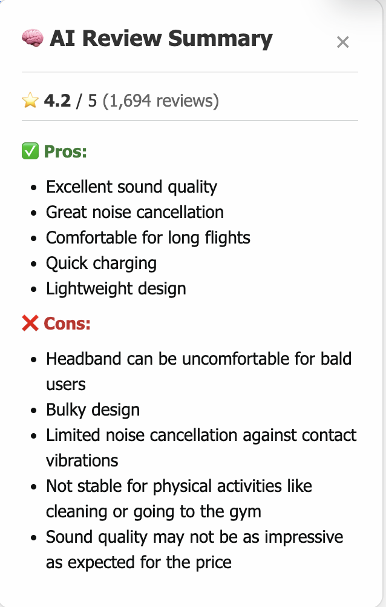

# LLM Reviewer Backend

**LLM Reviewer** is a FastAPI backend that leverages advanced language models (LLMs) to automatically summarize customer reviews. Designed to work seamlessly with the [llm-reviewer-frontend](https://github.com/yourusername/llm-reviewer-frontend) browser extension, it enables users to scrape reviews from the product pages and instantly receive AI-powered summaries of the top pros and cons. By processing reviews in any language through a chain of LLM-powered steps, this backend helps users quickly understand a product’s strengths and weaknesses without reading hundreds of individual reviews.

---

## 🧠 Real-World AI in Action

AI is transforming how we interact with information. In this project, AI is used to:
- **Aggregate and analyze large volumes of user-generated content** (reviews)
- **Extract key insights** (pros and cons) that matter most to potential buyers
- **Deliver instant, actionable summaries** for better, faster decision-making

This is a practical example of how LLMs can be used to automate research, enhance e-commerce experiences, and save users valuable time.

---

## 🌐 How It Works: End-to-End Flow

1. **User browses an Amazon product page**
2. **llm-reviewer-frontend browser extension** scrapes all visible reviews
3. The extension sends the reviews to this backend's `/summarize` API endpoint
4. The backend uses a LangChain-powered LLM chain to analyze and summarize the reviews
5. The extension displays the summary (pros and cons) directly in the browser

---

## ⚠️ Educational Use Disclaimer

**The scraping functionality provided by the llm-reviewer-frontend extension is intended for educational purposes only. Please respect the terms of service of any website you interact with and use this tool responsibly.**

---

## 📊 Example Output

When reviewing [Sony WH-1000XM5 Headphones](https://www.amazon.com/Sony-WH-1000XM5-Headphones-Hands-Free-WH1000XM5/dp/B0BXYCS74H/ref=sr_1_1_sspa?...), the extension might display:




## 🛠️ Project Structure

- `main.py` — FastAPI app with endpoints for review summarization
- `app/chains.py` — Defines the LLM chain and prompt for summarization
- `app/models.py` — Pydantic model for request validation
- `app/utils.py` — Utility to extract pros and cons from LLM output
- `app/config.py` — Loads environment variables (e.g., OpenAI API key)
- `requirements.txt` — Python dependencies

---

## ⚡ Getting Started

### 1. Clone the repository
```bash
git clone <your-repo-url>
cd LLM_Reviewer
```

### 2. Create and activate a virtual environment
```bash
python3 -m venv venv
source venv/bin/activate
```

### 3. Install dependencies
```bash
pip install -r requirements.txt
```

### 4. Set up your OpenAI API key
Create a `.env` file in the project root:
```
OPENAI_API_KEY=your_openai_api_key_here
```

### 5. Run the application
```bash
uvicorn main:app --reload
```

### 6. Access the API docs
Open [http://localhost:8000/docs](http://localhost:8000/docs) in your browser.

---

## 🔗 Frontend Integration

To use the full product review summarization experience, install the [llm-reviewer-frontend](https://github.com/yourusername/llm-reviewer-frontend) browser extension. The extension will automatically detect and send reviews to this backend, displaying the summary in your browser.

---

## 📬 API Usage

### `POST /summarize`
Send a list of reviews and receive a summary of pros and cons.

**Request Body:**
```json
{
  "reviews": [
    "Great product!",
    "Muy bueno, me encantó.",
    "Nicht so gut, leider enttäuscht."
  ]
}
```

**Response:**
```json
{
  "pros": ["..."],
  "cons": ["..."]
}
```

---

## 📢 Contributing
Pull requests are welcome! For major changes, please open an issue first to discuss what you would like to change.

## 📄 License
MIT 